# Section 2-1: Introduction to the CS-330 Tutorials

All the code for this course's tutorials is stored within the same Git repository as the tutorials themselves. At the root folder of the repository there is a Visual Studio solution file named `cs330_tutorials.sln` that contains the Visual Studio projects for each of the tutorials.

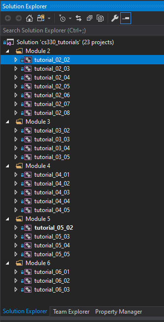

These tutorials require several OpenGL libraries, so in order to make the configuration of the projects easier, a couple property sheets named `Graphics_x64.props` and `Graphics_win32.props` have been added to the root of the repository (at the same level as the visual studio solution file). 

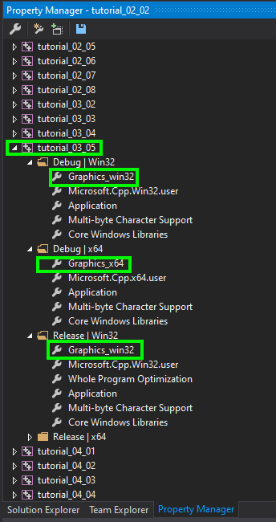

Please open these files in Visual Studio and make sure you examine them to understand:

* how we configure Visual Studio with the directories to the header files

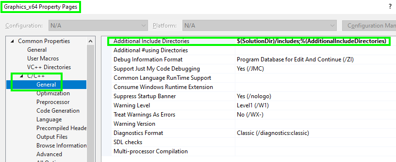

* how libraries are linked into the executable: by pointing Visual Studio to the location of the libraries, and listing the names of the libraries required

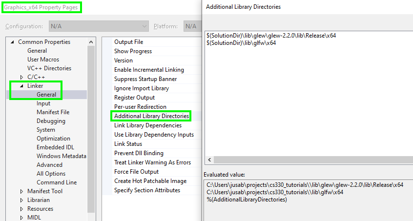 | 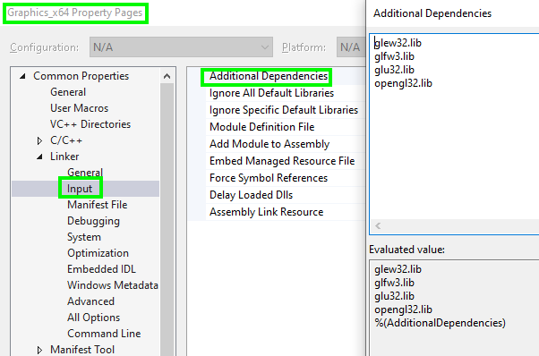

* Finally, we write a _postbuild_ action to copy the dynamic libraries (aka DLLs) to the _output directory_ that contains the executable. This output directory is also configured in the property sheet.

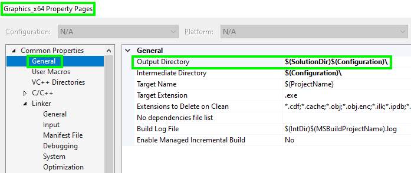 | 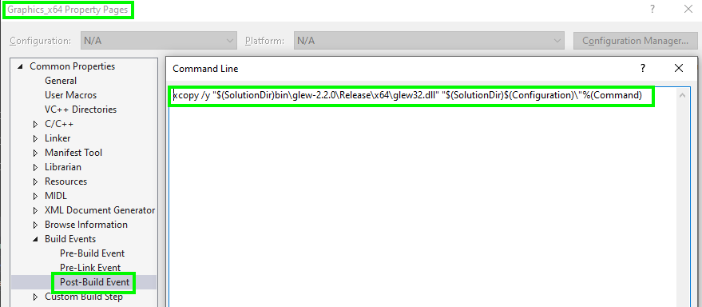

# Section 2-2: Creating an OpenGL Application

The code for this section ([tut_02_02.cpp](./tut_02_02.cpp)) demonstrates how to create a simple OpenGL application:

* initialize GLFW and GLEW
* create a window and an OpenGL context

This example has two functions that you should pay attention to. These two functions will remain almost unchanged for the rest of this module's tutorials.

## The main function and the Render Loop

The main function calls `UInitialize` and runs an infinite loop called the _render loop_ (in game dev, this is sometimes called the _game loop_). The render loop draws every frame of the application, so the frequency with which it is called dictates the frame rate (e.g. 60 fps).

    // main function. Entry point to the OpenGL program
    int main(int argc, char* argv[])
    {
        // Main GLFW window
        GLFWwindow* window = nullptr;

        if (!UInitialize(argc, argv, &window))
            return EXIT_FAILURE;

        // Sets the background color of the window to black (it will be implicitely used by glClear)
        glClearColor(0.0f, 0.0f, 0.0f, 1.0f);

        // render loop
        // -----------
        while (!glfwWindowShouldClose(window))
        {
            // input
            // -----
            UProcessInput(window);

            // Clear the background
            glClearColor(0.0f, 0.0f, 0.0f, 1.0f);
            glClear(GL_COLOR_BUFFER_BIT);

            // glfw: swap buffers and poll IO events (keys pressed/released, mouse moved etc.)
            glfwSwapBuffers(window);    // Flips the the back buffer with the front buffer every frame.
            glfwPollEvents();
        }

        exit(EXIT_SUCCESS); // Terminates the program successfully
    }

## Initialization

The `UInitialize` function, which is called once (from the `main` function and right before the first iteration of the render loop), initializes GFLW, creates the window and the OpenGL context, and also initializes GLEW (to load the function pointers to OpenGL's API).

    bool UInitialize(int argc, char* argv[], GLFWwindow** window)
    {
        // GLFW: initialize and configure (specify desired OpenGL version)
        // ------------------------------
        glfwInit();
        glfwWindowHint(GLFW_CONTEXT_VERSION_MAJOR, 4);
        glfwWindowHint(GLFW_CONTEXT_VERSION_MINOR, 4);
        glfwWindowHint(GLFW_OPENGL_PROFILE, GLFW_OPENGL_CORE_PROFILE);

    #ifdef __APPLE__
        glfwWindowHint(GLFW_OPENGL_FORWARD_COMPAT, GL_TRUE);
    #endif

        // GLFW: window creation
        // ---------------------
        *window = glfwCreateWindow(WINDOW_WIDTH, WINDOW_HEIGHT, WINDOW_TITLE, NULL, NULL);
        if (*window == NULL)
        {
            std::cout << "Failed to create GLFW window" << std::endl;
            glfwTerminate();
            return false;
        }
        glfwMakeContextCurrent(*window);
        glfwSetFramebufferSizeCallback(*window, UResizeWindow);

        // GLEW: initialize
        // ----------------
        // Note: if using GLEW version 1.13 or earlier
        glewExperimental = GL_TRUE;
        GLenum GlewInitResult = glewInit();

        if (GLEW_OK != GlewInitResult)
        {
            std::cerr << glewGetErrorString(GlewInitResult) << std::endl;
            return false;
        }

        // Displays GPU OpenGL version
        cout << "INFO: OpenGL Version: " << glGetString(GL_VERSION) << endl;

        return true;
    }

If you compile, link and run this example, you should see a window titled "Tutorial 2.2" with a black screen. The black screen is the result of the following two lines of code (contained in the `main` function)

    glClearColor(0.0f, 0.0f, 0.0f, 1.0f);
    glClear(GL_COLOR_BUFFER_BIT);

### Exercise:

Check out the documentation for [`glClearColor`](https://www.khronos.org/registry/OpenGL-Refpages/gl4/html/glClearColor.xhtml), and modify its parameters so the background is red instead of black. Make sure that you check both lines 40 and 51 in the code as you work. 

Note: When you are ready to quit running the program, press the Esc button.

# Section 2-3: Creating a Vertex Buffer Object and a Vertex Array Object

The code for this section ([tut_02_03.cpp](./tut_02_03.cpp)) demonstrates how to:

* transfer vertex data to the GPU using a _Vertex Buffer Object_ (VBO) and a _Vertex Array Object_ (VAO).

A Vertex Buffer Object (VBO) is an OpenGL feature that provides methods for uploading vertex data (position, normal vector, color, etc.) to the video device for non-immediate-mode rendering. VBOs offer substantial performance gains over immediate mode rendering primarily because the data resides in the video device memory rather than the system memory and so it can be rendered directly by the video device.

In the following exercise we are going to transfer to the GPU the location of the vertices of a triangle. The code that accomplishes this is encapsulated inside function `UCreateMesh`

    void UCreateMesh(GLMesh &mesh)
    {
        // Specifies Normalized Device Coordinates for triangle vertices
        GLfloat verts[]=
        {
             0.0f,  1.0f, 0.0f, // top-center of the screen
            -1.0f, -1.0f, 0.0f, // bottom-left of the screen
             1.0f, -1.0f, 0.0f  // bottom-right of the screen
        };

        mesh.nvertices = 3;
        
        glGenVertexArrays(1, &mesh.vao); // we can also generate multiple VAOs or buffers at the same time
        glGenBuffers(1, &mesh.vbo); // Creates 1 buffer
        glBindVertexArray(mesh.vao);
        glBindBuffer(GL_ARRAY_BUFFER, mesh.vbo); // Activates the buffer
        glBufferData(GL_ARRAY_BUFFER, sizeof(verts), verts, GL_STATIC_DRAW); // Sends vertex or coordinate data to the GPU

The previous snippet creates an array of floats to store the _normalized device coordinates_ of the vertices of the triangle. As you can observe, the z coordinate for all three vertices is `0.0` because the triangle lies on the plane `z = 0` -- which is parallel to the projection plane of the camera.

Remember that VAOs are containers for VBOs: once you bind a VAO, any VBOs that you bind afterwards will be tied to this currently active VAO, and they could later be activated by binding this _parent_ VAO (no need to also bind the VAO's VBOs). A VAO is bound with function `glBindVertexArray`, and a VBO with `glBindBuffer`.

Before we move on to the next tutorial, note the following:

* The VAO and VBO created in `UCreateMesh` are destroyed in function `UDestroyMesh`.
* We have created a triangle (by specifying its normalized device coordinates) and transferred its data to the GPU inside a VBO, but we have yet to render it. Therefore, if you compile, link and run this example, you should still see a screen with a solid background (in the color specified by the call to `glClearColor`), and no triangle in sight.
* We store the ids for the VAO and the VBO in an instance of the struct GLMesh. We will need these ids to activate the buffers and to destroy them.

        struct GLMesh
        {
            GLuint vao;     // Handle for the vertex array object
            GLuint vbo;     // Handle for the vertex buffer object
            GLuint nvertices;   // Number of vertices of the mesh
        };

# Section 2-4: Creating a Shader Program and Drawing a Triangle

The code for this section ([tut_02_04.cpp](./tut_02_04.cpp)) demonstrates how to:

* Compile a vertex and a fragment shader, and then create (and destroy) a shader program
* Access different attributes of the vertex data stored in a VBO
* Tell OpenGL to draw a specific mesh

## Building a Shader Program

A shader program is, at a minimum, a combination of a _vertex shader_ and a _fragment shader_. The OpenGL pipeline calls the vertex shader once per vertex, and the fragment shader once per pixel. For example, if we are drawing a triangle, the vertex shader gets called three times -- each call will receive as input the data for one of the three vertices. On the other hand, the number of times the fragment shader gets called does not directly depend on the complexity of the mesh, but on the number of pixels covered by its projection onto the projection plane. For example, if the triangle is very small and/or is very far from the camera, its projection will cover very few pixels (e.g. 100 pixels), and that's how many times the fragment shader will get called. If, however, the projection covers a large part of the window (even all of it), the fragment shader will get called many more times. So, the vertex shader gets called once per vertex in a mesh, and it receives as input the data specific to that vertex (e.g. location, color, texture coordinates, normal vector...), while the fragment shader gets called once for each pixel covered by the projection of the mesh, and it receives as input the data required to shade that one pixel (more on this later).

This tutorial shows about the simplest vertex and fragment shaders you can have. Starting with the following vertex shader

    // Vertex Shader Program Source Code
    #version 440 core
    layout (location = 0) in vec3 aPos;
    void main()
    {
        gl_Position = vec4(aPos.x, aPos.y, aPos.z, 1.0);
    }

The programming language used to write shader code in OpenGL is GLSL, and the first precompiler directive tells OpenGL's compiler what version of the API the shader is written for. The second line (starting with `layout`), tells OpenGL how the data stored in the VBO is arranged (more on this later). Finally, every shader program has a `main` function (just like any C++ application), and in this particular vertex shader, all the `main` function does is output the position of this vertex -- when working in 3D (in future tutorials), the vertex shader will output the vertex position after applying the perspective projection; for this example, we output the vertex coordinates in normalized device coordinates.

The following fragment shader sets the color of this fragment (i.e. pixel) to green. In other words, all of the pixels covered by the projection of this triangle will get the same green color. Also, note that the color is represented by a 4D vector, with its components being: red, green, blue and the opacity: all four values fall in the range `[0.0, 1.0]`, and for the opacity, `1.0` means fully opaque (`0.0` is fully transparent).

    #version 440 core
    out vec4 FragColor;
    void main()
    {
        FragColor = vec4(0.0f, 1.0f, 0.0f, 1.0f);
    }

The vertex and fragment shader code needs to be compiled and linked -- this is what makes a shader program. We are going to encapsulate this code into a new function, `UCreateShaderProgram`, and we will be cleaning up the data allocated for this purpose in the analogous function `UDestroyShaderProgram`. We call this function from the `main` function ( right after calling `UCreateMesh`).

    void UCreateShaderProgram(const char* vtxShaderSource, const char* fragShaderSource, GLuint &programId)
    {
        // Create a Shader program object.
        programId = glCreateProgram();

        // Create the vertex and fragment shader objects
        GLuint vertexShaderId = glCreateShader(GL_VERTEX_SHADER);
        GLuint fragmentShaderId = glCreateShader(GL_FRAGMENT_SHADER);

        // Retrive the shader source
        glShaderSource(vertexShaderId, 1, &vtxShaderSource, NULL);
        glShaderSource(fragmentShaderId, 1, &fragShaderSource, NULL);

        // Compile both shaders
        glCompileShader(vertexShaderId);
        glCompileShader(fragmentShaderId);

        // Attached compiled shaders to the shader program
        glAttachShader(programId, vertexShaderId);
        glAttachShader(programId, fragmentShaderId);

        glLinkProgram(programId);
    }

    void UDestroyShaderProgram(GLuint programId)
    {
        glDeleteProgram(programId);
    }

Note how this function compiles each shader separately, then attaches them to a single shader program, to finally link this program. At runtime, you might want to switch shader programs -- shader programs normally implement materials, and not all objects in a scene will use the same material. To tell OpenGL that you want to use a specific shader program, you need to call the function `glUseProgram`.

## Indexing Vertex Attributes

Remember that the vertex shader is receiving the vertex location (in normalized device coordinates) as a 3D vector (`aPos`). This data is stored in the VBO, but we need to tell OpenGL how to read the VBO -- there could be more than one attribute for each vertex. For this simple example, we are pulling this data out of attribute 0 of the currently bound VBO (the only attribute that exists). We set this up by adding the following three lines of code at the end of `UCreateMesh`

    // Creates the Vertex Attribute Pointer
    const GLuint floatsPerVertex = 3; // Number of coordinates per vertex
    glVertexAttribPointer(0, floatsPerVertex, GL_FLOAT, GL_FALSE, 0, 0);
    glEnableVertexAttribArray(0); // Specifies the initial position of the coordinates in the buffer

The first argument `0` in both the call to `glVertexAttribPointer` and `glEnableVertexAttribArray` is related to the `0` in the following line of the vertex shader.

    layout (location = 0) in vec3 aPos;

For this simple example, the VBO only contains location data, but we will see in the next tutorial how we will also store other type of vertex data (e.g. vertex color) -- this is why OpenGL needs our guidance in order to separate the different types of vertex attributes that need to be fed to the vertex shader.

## Drawing with glDrawArrays

Finally, we are ready to tell OpenGL to put all this together and draw the mesh stored in our VBO using the shader program we just created. This is accomplished by the function `URenderMesh`:

    void URenderMesh(const GLMesh& mesh)
    {
        glBindVertexArray(mesh.vao);

        // Draws the triangle
        glDrawArrays(GL_TRIANGLES, 0, mesh.nvertices); // Draws the triangle
    }

With a call to `glBindVertexArray` we activate our VAO -- remember that it is just a container for VBOs, so all these VBOs will also be bound at this point -- and then we call `glDrawArrays` (`glDrawArrays` is one of the most used functions in the OpenGL API, so make sure you review its [reference page](https://www.khronos.org/registry/OpenGL-Refpages/gl4/html/glDrawArrays.xhtml)).

And that's it. At this point your screen should look like:

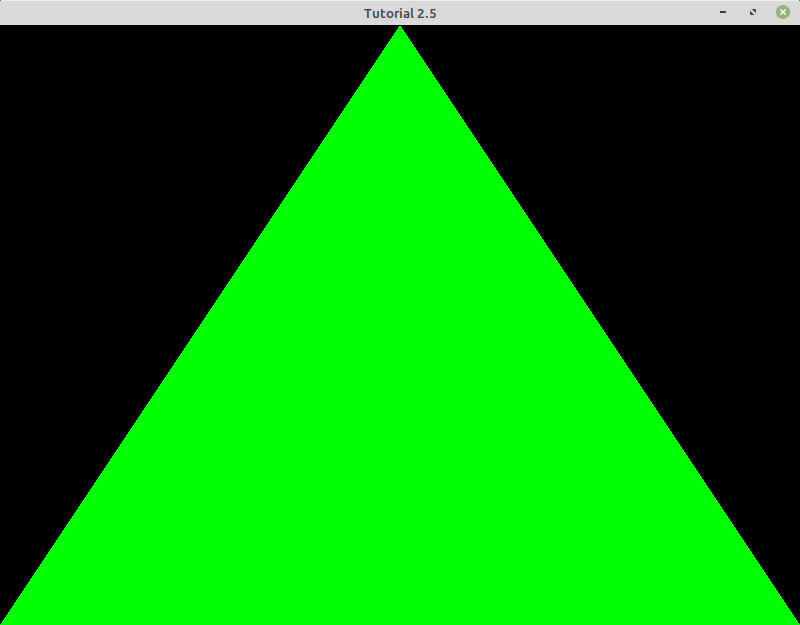

# Section 2-5: Reporting Shader Compilation and Linking Errors

The code for this section ([tut_02_05.cpp](./tut_02_05.cpp)) demonstrates how to:

* Report compilation and linking errors when building a shader program.

In the previous tutorial, we added the `UCreateShaderProgram` function, which compiles the vertex and fragment shaders, and then links them into a single shader program. These compilation and linking operations occur at runtime, so what happens if there are errors? How will we know what went wrong? To solve this issue we are going to enhance the `UCreateShaderProgram` function to report these errors by printing them to the console output.

    bool UCreateShaderProgram(const char* vtxShaderSource, const char* fragShaderSource, GLuint &programId)
    {
        // Compilation and linkage error reporting
        int success = 0;
        char infoLog[512];

        // Create a Shader program object.
        programId = glCreateProgram();

        // Create the vertex and fragment shader objects
        GLuint vertexShaderId = glCreateShader(GL_VERTEX_SHADER);
        GLuint fragmentShaderId = glCreateShader(GL_FRAGMENT_SHADER);

        // Retrive the shader source
        glShaderSource(vertexShaderId, 1, &vtxShaderSource, NULL);
        glShaderSource(fragmentShaderId, 1, &fragShaderSource, NULL);

        // Compile the vertex shader, and print compilation errors (if any)
        glCompileShader(vertexShaderId); // compile the vertex shader
        // check for shader compile errors
        glGetShaderiv(vertexShaderId, GL_COMPILE_STATUS, &success);
        if (!success)
        {
            glGetShaderInfoLog(vertexShaderId, 512, NULL, infoLog);
            std::cout << "ERROR::SHADER::VERTEX::COMPILATION_FAILED\n" << infoLog << std::endl;

            return false;
        }

        glCompileShader(fragmentShaderId); // compile the fragment shader
        // check for shader compile errors
        glGetShaderiv(fragmentShaderId, GL_COMPILE_STATUS, &success);
        if (!success)
        {
            glGetShaderInfoLog(fragmentShaderId, sizeof(infoLog), NULL, infoLog);
            std::cout << "ERROR::SHADER::FRAGMENT::COMPILATION_FAILED\n" << infoLog << std::endl;

            return false;
        }

        // Attached compiled shaders to the shader program
        glAttachShader(programId, vertexShaderId);
        glAttachShader(programId, fragmentShaderId);

        glLinkProgram(programId);   // links the shader program
        // check for linking errors
        glGetProgramiv(programId, GL_LINK_STATUS, &success);
        if (!success)
        {
            glGetProgramInfoLog(programId, sizeof(infoLog), NULL, infoLog);
            std::cout << "ERROR::SHADER::PROGRAM::LINKING_FAILED\n" << infoLog << std::endl;

            return false;
        }

        glUseProgram(programId);    // Uses the shader program

        return true;
    }

    void UDestroyShaderProgram(GLuint programId)
    {
        glDeleteProgram(programId);
    }

The code above checks the status of compilation with function `glGetShaderiv` and, if unsuccessful, it retrieves the compilation errors with `glGetShaderInfoLog`. Similarly, the status of linking is queried via the function `glGetProgramiv` and, if unsuccessful, it retrieves the specific error message with function `glGetProgramInfoLog`. In both cases we choose to return `false` to report the failed creation of the shader program (it is up to the caller of this function to continue or abort the execution of the program). 

### Exercise:

Modify the vertex/fragment shader to intentionally introduce a syntax error (e.g. remove a semicolon), then compile the project and run it. What errors do you see? Would that information be sufficient to fix the shader code?

# Section 2-6: Adding Color to Vertices

The code for this section ([tut_02_06.cpp](./tut_02_06.cpp)) demonstrates how to:

* Store more than one vertex attribute in the same VBO
* Interpolate vertex data to be used in the fragment shader (e.g. vertex color)

## How to Store a Second Attribute in the same VBO

The _Vertex Buffer Objects_ store vertex data in the GPU. So far we have stored only the location, but we are going to change that to store also a different color for each one of the vertices.

In function `UCreateMesh` we update the array with vertex info to include a color for each vertex

    // Specifies Normalized Device Coordinates (x,y,z) and color (r,g,b,a) for triangle vertices
    GLfloat verts[]=
    {
        0.0f, 1.0f, 0.0f,       // top-center of the screen
        1.0f, 0.0f, 0.0f, 1.0f, // red

        -1.0f, -1.0f, 0.0f,     // bottom-left of the screen
        0.0f, 1.0f, 0.0f, 1.0f, // green
        
        1.0f, -1.0f, 0.0f,      // bottom-right of the screen
        0.0f, 0.0f, 1.0f, 1.0f  // blue
    };

and then we tell OpenGL that this data is there and stored at attribute location 1.

    // Creates the Vertex Attribute Pointer for the screen coordinates
    const GLuint floatsPerVertex = 3; // Number of coordinates per vertex
    const GLuint floatsPerColor = 4;  // (r, g, b, a)

    // Strides between vertex coordinates is 6 (x, y, r, g, b, a). A tightly packed stride is 0.
    GLint stride =  sizeof(float) * (floatsPerVertex + floatsPerColor);// The number of floats before each

    // Instructs the GPU on how to handle the vertex buffer object data.
    // Parameters: attribPointerPosition | coordinates per vertex is 2, i.e., x and y |   data type | deactivate normalization |  0 strides | 0 offset
    glVertexAttribPointer(0, floatsPerVertex, GL_FLOAT, GL_FALSE, stride, 0);
    glEnableVertexAttribArray(0);

    // Parameters: attribPointerPosition 1 | floats per color is 4, i.e., rgba | data type | deactivate normalization | 6 strides until the next color, i.e., rgbaxy | 2 floats until the beginning of each color, i.e,. xy
    glVertexAttribPointer(1, floatsPerColor, GL_FLOAT, GL_FALSE, stride, (char*)(sizeof(float) * floatsPerVertex));
    glEnableVertexAttribArray(1);

Also, note that we have also changed the call to `glVertexAttribPointer` associated with attribute `0`, since now we need to provide a stride value different than zero (to account for the seven floats that are required to store the data for each vertex: three floats for the location, and four for the color).

    // Strides between vertex coordinates is 6 (x, y, r, g, b, a). A tightly packed stride is 0.
    GLint vertexStride =  sizeof(float) * 6;// The number of floats before each

    // Instructs the GPU on how to handle the vertex buffer object data.
    // Parameters: attribPointerPosition | coordinates per vertex is 2, i.e., x and y |   data type | deactivate normalization |  0 strides | 0 offset
    glVertexAttribPointer(0, floatsPerVertex, GL_FLOAT, GL_FALSE, vertexStride, 0);

## Accessing Vertex Colors in the Vertex and the Fragment Shader

With the vertex color successfully stored in our VBO, now we need to put them to work in the shader code. To do this, we update the vertex shader to look like follows:

    #version 440 core
    layout (location = 0) in vec3 aPos;
    layout (location = 1) in vec4 colorFromVBO;
    out vec4 colorFromVS;
    void main()
    {
       gl_Position = vec4(aPos.x, aPos.y, aPos.z, 1.0);
       colorFromVS = colorFromVBO;
    }

You should spot the three lines that have been added:

    layout (location = 1) in vec4 colorFromVBO;

The first statement maps the vertex data stored as attribute 1 to a `vec4` called `colorFromVBO`. The second one is the declaration of an `out vec4` called `colorFromVS`, which will be used to pass the vertex color to the fragment shader. OpenGL will do a bilinear interpolation of these vertex colors, so any point inside the triangle gets a combination of the color of the three vertices based on the distance of this point to the three vertices. We directly transfer this data from the VBO to the output of the vertex shader with the statement:

    colorFromVS = colorFromVBO;

The fragment shader needs to be updated to receive as input this interpolated vertex color.

    #version 440 core
    in vec4 colorFromVS;
    out vec4 FragColor;
    void main()
    {
        FragColor = colorFromVS;
    }

And then set its output to the incoming interpolated color from the vertex shader. This tutorial produces the following outcome:

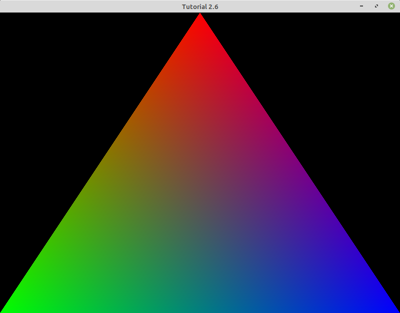

# Section 2-7: Drawing Multiple Shapes

The code for this section ([tut_02_07.cpp](./tut_02_07.cpp)) demonstrates how to:

* Draw multiple shapes by specifying multiple coordinates in the Vertex Buffer Object.

We modify the `UCreateMesh` function so it holds the data for, not three, but six vertices:

    // Specifies Normalized Device Coordinates (x,y,z) and color (r,g,b,a) for triangle vertices
    GLfloat verts[]=
    {
        -0.5f, 0.0f, 0.0f,      // top-first_third of the screen
        1.0f, 0.0f, 0.0f, 1.0f, // red

        -1.0f, -1.0f, 0.0f,     // bottom-left of the screen
        0.0f, 0.0f, 1.0f, 1.0f, // blue

        0.0f, -1.0f, 0.0f,      // bottom-center of the screen
        0.0f, 1.0f, 0.0f, 1.0f, // green

        0.5f, 0.0f, 0.0f,       // top-second_third of the screen
        1.0f, 0.0f, 0.0f, 1.0f, // red

        0.0f, -1.0f, 0.0f,      // bottom-center of the screen
        0.0f, 0.0f, 1.0f, 1.0f, // blue

        1.0f, -1.0f, 0.0f,      // bottom-right of the screen
        0.0f, 1.0f, 0.0f, 1.0f  // green
    };

    mesh.nvertices = 6;

No other change is required, since the call to `glDrawArrays` (in `URenderMesh`) is already written to handle the number of vertices (stored in `mesh.nvertices`).

The final outcome should look like:

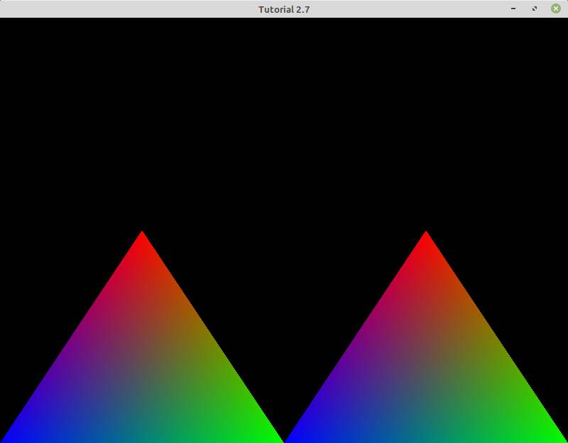

# Section 2-8: Using Indices (Index Buffers) to Share Vertex Coordinates

The code for this section ([tut_02_08.cpp](./tut_02_08.cpp)) demonstrates how to:

* Reuse vertex data shared by more than one triangle.

Indices allow sharing vertex data for triangles that have a vertex in common (note that vertices that share the same coordinates also must share the same color; in other words, if two vertices must have different colors, then we have to duplicate their location).

Below are the index buffer numbers that will be used to represent positions on the window. The triangles will share the same position or coordinates at index 2. The indices are 0,1,2, 3,2,4. The following image shows the final outcome of this tutorial.

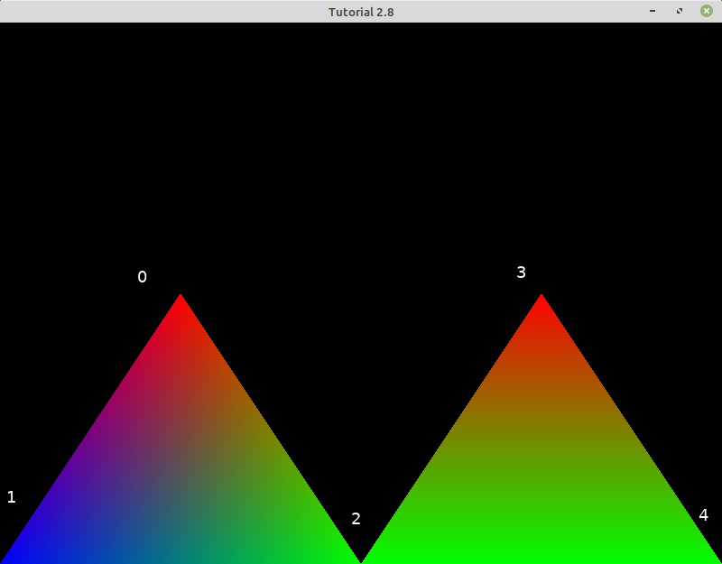

The definition of the array `verts` (in `UCreateMesh`) has been updated to remove the duplicate vertex -- therefore we are left with five vertices.

    // Specifies Normalized Device Coordinates (x,y,z) and color (r,g,b,a) for triangle vertices
    GLfloat verts[]=
    {
        // The two triangles will be drawn using indices
        // Left triangle indices: 0, 1, 2
        // Right triangle indices: 3, 2, 4

        // index 0
        -0.5f, 0.0f, 0.0f,      // top-first_third of the screen
        1.0f, 0.0f, 0.0f, 1.0f, // red

        // index 1
        -1.0f, -1.0f, 0.0f,     // bottom-left of the screen
        0.0f, 0.0f, 1.0f, 1.0f, // blue

        // index 2
        0.0f, -1.0f, 0.0f,      // bottom-center of the screen
        0.0f, 1.0f, 0.0f, 1.0f, // green

        // index 3
        0.5f, 0.0f, 0.0f,       // top-second_third of the screen
        1.0f, 0.0f, 0.0f, 1.0f, // red

        // index 4
        1.0f, -1.0f, 0.0f,      // bottom-right of the screen
        0.0f, 1.0f, 0.0f, 1.0f  // green
    };

Next, we have created a VBO to store the indices. For this purpose, we have modified `UCreateMesh` to create two VBOs and make one of them of type `GL_ELEMENT_ARRAY_BUFFER`.

    // Create 2 buffers: first one for the vertex data; second one for the indices
    glGenBuffers(2, mesh.vbos);
    glBindBuffer(GL_ARRAY_BUFFER, mesh.vbos[0]); // Activates the buffer
    glBufferData(GL_ARRAY_BUFFER, sizeof(verts), verts, GL_STATIC_DRAW); // Sends vertex or coordinate data to the GPU
    
    GLushort indices[] = {0, 1, 2, 3, 2, 4}; // Using index 2 twice
    mesh.nIndices = sizeof(indices) / sizeof(indices[0]);

    glBindBuffer(GL_ELEMENT_ARRAY_BUFFER, mesh.vbos[1]);
    glBufferData(GL_ELEMENT_ARRAY_BUFFER, sizeof(indices), indices, GL_STATIC_DRAW);

Note that we no longer store the number of vertices as a member of `GLMesh`, but instead now we store the number of indices

    mesh.nIndices = sizeof(indices) / sizeof(indices[0]);
    
The final change requires replacing the call to `glDrawArrays` with a call to `glDrawElements`. `glDrawElments` tells OpenGL to draw using the indices stored in the index array. Now the function `URenderMesh` looks as follows:

    void URenderMesh(const GLMesh& mesh)
    {
        glBindVertexArray(mesh.vao);

        // Draws the triangle
        glDrawElements(GL_TRIANGLES,  mesh.nvertices, GL_UNSIGNED_SHORT, NULL); // Draws the triangle
    }

