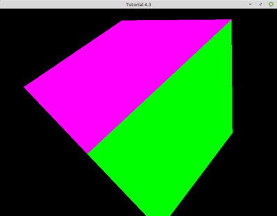
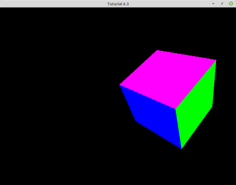
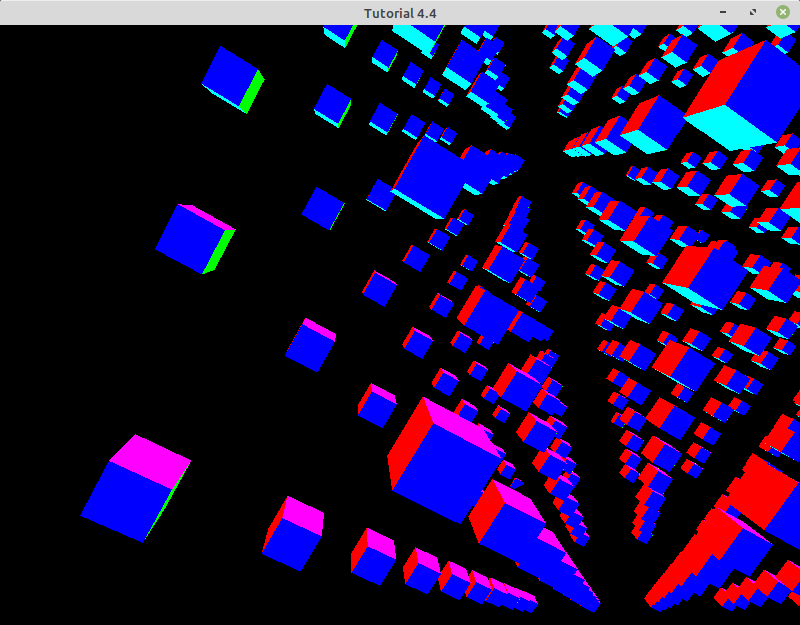

# Section 4-1: Handling Keyboard Input

The code for this section ([tut_04_01.cpp](./tut_04_01.cpp)) demonstrates how to

* handle keyboard input using GLFW

This tutorial is a bare-bones application that initializes GLFW, GLEW and OpenGL; creates a window and an OpenGL context; and handles keyboard input.

Up until this tutorial, the function `UProcessInput` was only used to handle the `ESC` key (to terminate the application). In this tutorial we update it to also handle keys `W,` `A`, `S` and `D`.

    void UProcessInput(GLFWwindow* window)
    {
        if (glfwGetKey(window, GLFW_KEY_ESCAPE) == GLFW_PRESS)
            glfwSetWindowShouldClose(window, true);

        bool keypress = false;

        if (glfwGetKey(window, GLFW_KEY_W) == GLFW_PRESS)
        {
            cout << "You pressed W! ";
            keypress = true; 
        }
        if (glfwGetKey(window, GLFW_KEY_S) == GLFW_PRESS)
        {
            cout << "You pressed S! ";
            keypress = true; 
        }
        if (glfwGetKey(window, GLFW_KEY_A) == GLFW_PRESS)
        {
            cout << "You pressed A! ";
            keypress = true; 
        }
        if (glfwGetKey(window, GLFW_KEY_D) == GLFW_PRESS)
        {
            cout << "You pressed D! ";
            keypress = true; 
        }

        if (keypress)
        {
            double x, y;
            glfwGetCursorPos(window, &x, &y);
            cout << "Cursor at position (" << x << ", " << y << ")" << endl;
        }
    }


In GLFW, we get the status of an specific key with function `glfwGetKey`, with only two possible outcomes: `GLFW_PRESS` OR `GLFW_RELEASE`. Each one of the keys has an specific identifier. In our case, `GLFW_KEY_W`, `GLFW_KEY_S`, `GLFW_KEY_A` and `GLFW_KEY_D`. If one of these keys is pressed, we print a message to the standard output stream stating so. Finally, if any of these keys was down in the last frame, we also print the current position of the cursor: using function `glfwGetCursorPos`.

When you run the application, be sure to press a key so something occurs. Although your screen will appear black, your output should look similar to:

```
INFO: OpenGL Version: 4.4.0 NVIDIA 440.100
You pressed A! Cursor at position (251, 491)
You pressed A! Cursor at position (251, 491)
You pressed A! Cursor at position (251, 491)
You pressed A! Cursor at position (251, 491)
You pressed A! Cursor at position (251, 491)
You pressed A! Cursor at position (251, 491)
You pressed A! Cursor at position (251, 491)
You pressed A! Cursor at position (251, 491)
You pressed A! Cursor at position (251, 491)
You pressed A! Cursor at position (251, 491)
You pressed A! Cursor at position (251, 491)
You pressed A! Cursor at position (251, 491)
You pressed A! Cursor at position (251, 491)
You pressed A! Cursor at position (251, 491)
You pressed W! Cursor at position (251, 491)
You pressed W! Cursor at position (251, 491)
You pressed W! Cursor at position (251, 491)
You pressed W! Cursor at position (251, 491)
You pressed W! Cursor at position (251, 491)
You pressed W! Cursor at position (251, 491)
You pressed W! Cursor at position (251, 491)
You pressed W! Cursor at position (251, 491)
You pressed W! Cursor at position (251, 491)
You pressed W! Cursor at position (251, 491)
You pressed W! Cursor at position (251, 491)
You pressed W! Cursor at position (251, 491)
You pressed W! Cursor at position (251, 491)
You pressed D! Cursor at position (251, 491)
```

### Exercise

Check out ([GLFW's documentation] https://www.glfw.org/docs/latest/group__keys.html) and augment `UProcessInput` to handle multiple keys at the same time. For example, print a message to the screen if `Shift` and `A` are pressed simultaneously.


# Section 4-2: Handling Mouse Input

The code for this section ([tut_04_02.cpp](./tut_04_02.cpp)) demonstrates how to

* handle mouse input using GLFW

There are three different tasks that we need to implement to cover all mouse input:

* retrieve the position of the cursor
* handle scrolling events
* handle mouse clicks

In order to do this, we are going to implement three callback functions:

```
void UMousePositionCallback(GLFWwindow* window, double xpos, double ypos);
void UMouseScrollCallback(GLFWwindow* window, double xoffset, double yoffset);
void UMouseButtonCallback(GLFWwindow* window, int button, int action, int mods);
```

We need to register these callbacks functions so GLFW knows what code to execute for each of the three different types of mouse events. In the `UInitialize` function we register these three callbacks:

```
glfwSetCursorPosCallback(*window, UMousePositionCallback);
glfwSetScrollCallback(*window, UMouseScrollCallback);
glfwSetMouseButtonCallback(*window, UMouseButtonCallback);
```

## Mouse Position Callback

The mouse position callback is straightforward. Whenever the mouse moves, the callback gets called, getting as input the x and y screen coordinates of the cursor.

```
// glfw: whenever the mouse moves, this callback is called
// -------------------------------------------------------
void UMousePositionCallback(GLFWwindow* window, double xpos, double ypos)
{
    cout << "Mouse at (" << xpos << ", " << ypos << ")" << endl;
}
```

## Mouse Scrolling Callback

The mouse scroll callback is pretty similar. For a regular mouse the `xoffset` input will always be zero, since the wheel is one-dimensional (either goes up or down). A value of `yoffset` of `1.0` means rolling one way, and `-1.0` the opposite -- test which one is which. Note: The reason why this callback gets both a `xoffset` and `yoffset` is to support more advanced input devices. 

```
// glfw: whenever the mouse scroll wheel scrolls, this callback is called
// ----------------------------------------------------------------------
void UMouseScrollCallback(GLFWwindow* window, double xoffset, double yoffset)
{
    cout << "Mouse wheel (" << xoffset << ", " << yoffset << ")" << endl;
}
```

## Mouse Button Callback

Finally, we examine the button callback, which is very similar to the keyboard handling callback (from tutorial 4.1). This function receives several input integer values. The two we care about are:

* __button__: it holds the id of the button triggering the event. For a regular three-button mouse, we might receive `GLFW_MOUSE_BUTTON_LEFT`, `GLFW_MOUSE_BUTTON_MIDDLE` or `GLFW_MOUSE_BUTTON_RIGHT`.
* __action__: as with the keyboard events, this variable can only hold two values, `GLFW_PRESS` or `GLFW_RELEASE`.

```
// glfw: handle mouse button events
// --------------------------------
void UMouseButtonCallback(GLFWwindow* window, int button, int action, int mods)
{
    switch (button)
    {
        case GLFW_MOUSE_BUTTON_LEFT:
        {
            if (action == GLFW_PRESS)
                cout << "Left mouse button pressed" << endl;
            else
                cout << "Left mouse button released" << endl;
        }
        break;

        case GLFW_MOUSE_BUTTON_MIDDLE:
        {
            if (action == GLFW_PRESS)
                cout << "Middle mouse button pressed" << endl;
            else
                cout << "Middle mouse button released" << endl;
        }
        break;

        case GLFW_MOUSE_BUTTON_RIGHT:
        {
            if (action == GLFW_PRESS)
                cout << "Right mouse button pressed" << endl;
            else
                cout << "Right mouse button released" << endl;
        }
        break;

        default:
            cout << "Unhandled mouse button event" << endl;
            break;
    }
}
```

When you run this application, your screen will appear black but your output should look similar to:

```
Mouse at (366, 376)
Mouse at (363, 376)
Mouse at (362, 376)
Mouse at (359, 376)
Mouse at (358, 376)
Mouse at (357, 376)
Mouse at (356, 377)
Mouse at (354, 377)
Mouse at (353, 377)
Mouse wheel (0, 1)
Mouse wheel (0, 1)
Mouse wheel (0, 1)
Mouse wheel (0, 1)
Mouse wheel (0, -1)
Mouse wheel (0, -1)
Mouse wheel (0, -1)
Mouse wheel (0, -1)
Mouse wheel (0, -1)
Mouse wheel (0, -1)
Mouse wheel (0, 1)
Mouse wheel (0, 1)
Mouse wheel (0, 1)
Mouse wheel (0, 1)
Mouse wheel (0, -1)
Mouse wheel (0, -1)
Left mouse button pressed
Left mouse button released
Middle mouse button pressed
Middle mouse button released
Right mouse button pressed
Right mouse button released
```

### Exercise

Modify the mouse position and mouse button callbacks so the position of the cursor is only printed when the left button is down.


# Section 4-3: Controlling the Camera with the Keyboard

The code for this section ([tut_04_03.cpp](./tut_04_03.cpp)) demonstrates how to

* draw a mesh with a color per face.
* update the position of the camera with the keyboard and GLM's `lookAt` function

## Per-Face (and not Per-Vertex) Colors

This tutorial contains quite a bit more code than 4.2, and it is actually closer to tutorial 3.4 (which introduced the perspective projection). But unlike tutorial 3.4, we want to draw a cube that has a color per face. This prevents us from drawing using indices -- and `glDrawElements` -- since each vertex will belong to three different faces, and each face will have a different color -- therefore we cannot share a vertex among different faces, so we will have to add three vertices for every actual location. If a cube has eight vertices, then we will end up with 24 vertices in total. Please take a look at `UCreateMesh`. Also, we will now go back to rendering using `glDrawArrays`.

## Camera Control

Since we are going to control the position of the camera (we will deal with the orientation in the next tutorial) with the keyboard, we first need to declare a couple of variables to store the camera's location and orientation. At the top of our file, and inside of the unnamed namespace, we add the following declarations:

```
glm::vec3 gCameraPos   = glm::vec3(0.0f, 0.0f,  3.0f);
glm::vec3 gCameraFront = glm::vec3(0.0f, 0.0f, -1.0f);
glm::vec3 gCameraUp    = glm::vec3(0.0f, 1.0f,  0.0f);
```

Any 3D object is defined by its location, and three orthogonal axis. As you can see in the previous declaration, we only define the _front_ (i.e. forward) and _up_ directions, but remember that computing the third one (right vector) is straightforward and only requires taking the cross product of the front and up vectors.

In the `UProcessInput` function, we tie the keystrokes `W` and `S` to actions of moving the camera forward/backward, and `A` and `D` with moving left/right:

```
void UProcessInput(GLFWwindow* window)
{
    static const float cameraSpeed = 2.5f;

    if (glfwGetKey(window, GLFW_KEY_ESCAPE) == GLFW_PRESS)
        glfwSetWindowShouldClose(window, true);

    float cameraOffset = cameraSpeed * gDeltaTime;

    if (glfwGetKey(window, GLFW_KEY_W) == GLFW_PRESS)
        gCameraPos += cameraOffset * gCameraFront;
    if (glfwGetKey(window, GLFW_KEY_S) == GLFW_PRESS)
        gCameraPos -= cameraOffset * gCameraFront;
    if (glfwGetKey(window, GLFW_KEY_A) == GLFW_PRESS)
        gCameraPos -= glm::normalize(glm::cross(gCameraFront, gCameraUp)) * cameraOffset;
    if (glfwGetKey(window, GLFW_KEY_D) == GLFW_PRESS)
        gCameraPos += glm::normalize(glm::cross(gCameraFront, gCameraUp)) * cameraOffset;
}
```

The distance that the camera travels is dictated by the speed (`cameraSpeed`) and the time elapsed since the last frame. For this purpose, we declare inside of the unnamed namespace the following two variables:

```
float gDeltaTime = 0.0f; // time between current frame and last frame
float gLastFrame = 0.0f;
```

The time elapsed is computed inside the _render loop_, in the `main` function:

```
float currentFrame = glfwGetTime();
gDeltaTime = currentFrame - gLastFrame;
gLastFrame = currentFrame;
```

With the camera position (`gCameraPos`) always up-to-date thanks to function `UProcessInput`, in `URender`, we use GLM's `lookAt` function to create the view matrix. This function requires three inputs: the camera's position, the target (what the camera is looking at) and the up vector of the camera.

```
glm::mat4 view = glm::lookAt(gCameraPos, gCameraPos + gCameraFront, gCameraUp);
```

Finally, we transfer its value to the vertex shader inside a uniform variable.

When you first start the application, you should see the image on the left, but if you move the camera back (by pressing `S`) and then to the left (by pressing `A`) you should see something similar to the image on the right:


 |  

### Exercise

Modify the `UProcessInput` function to also handle keys `Q` and `E`. For example, when pressing `E `move the camera straight up, and when pressing `Q` straight down.


# Section 4-4: Controlling the Camera with the Keyboard and Mouse

The code for this section ([tut_04_04.cpp](./tut_04_04.cpp)) demonstrates how to

* control the orientation of the camera with the mouse
* adjust the field-of-view of the perpective projection with the mouse wheel

So far we know how to move the camera forwards/backwards and left/right using the WASD keys, but we need more freedom than that. In order to be able to move in all directions, we are going to recruit the help of the mouse. Thankfully, LearnOpengl has a `Camera` class ([camera.h](../includes/learnOpengl/camera.h)) that does exactly what we need.

The `Camera` class has member variables that keep track of the state of the camera (e.g. location and orientation), as well as some configuration values (e.g. camera speed, mouse sensitivity...). In order to use this class we will need to initialize an instance of `Camera`, and then we will call four of its methods: `ProcessKeyboard`, `ProcessMouseMovement`, `ProcessMouseScroll` and `GetViewMatrix`.

## ProcessKeyboard

The `ProcessKeyboard` member function does basically what our `UProcessInput` function was doing in previous tutorials: it updates the position of the camera when keys `W`, `A`, `S` and/or `D` are pressed

## ProcessMouseScroll

The `ProcessMouseScroll` does not actually change the position or orientation of the camera, but it updates its `Zoom` value, which will be used to set the field-of-view of the perspective projection. Notice that the zoom value is clamped to the range `[1.0, 45.0]` degrees.

```
void Camera::ProcessMouseScroll(float yoffset)
{
    Zoom -= (float)yoffset;
    if (Zoom < 1.0f)
        Zoom = 1.0f;
    if (Zoom > 45.0f)
        Zoom = 45.0f; 
}
```

We call this function from `UMouseScrollCallback`.

## ProcessMouseMovement

This function handles the change in orientation. It takes as input the offset in x and y of the cursor: difference in position between this frame and the last frame. It uses this offset to update the yaw and pitch of the camera. Finally, it calls the `updateCameraVectors` to recompute the three axis of the camera (front, right and up).

```
void Camera::ProcessMouseMovement(float xoffset, float yoffset, GLboolean constrainPitch = true)
{
    xoffset *= MouseSensitivity;
    yoffset *= MouseSensitivity;

    Yaw   += xoffset;
    Pitch += yoffset;

    // make sure that when pitch is out of bounds, screen doesn't get flipped
    if (constrainPitch)
    {
        if (Pitch > 89.0f)
            Pitch = 89.0f;
        if (Pitch < -89.0f)
            Pitch = -89.0f;
    }

    // update Front, Right and Up Vectors using the updated Euler angles
    updateCameraVectors();
}
```

We call this function from our own `UMousePositionCallback`

```
void UMousePositionCallback(GLFWwindow* window, double xpos, double ypos)
{
    if (gFirstMouse)
    {
        gLastX = xpos;
        gLastY = ypos;
        gFirstMouse = false;
    }

    float xoffset = xpos - gLastX;
    float yoffset = gLastY - ypos; // reversed since y-coordinates go from bottom to top

    gLastX = xpos;
    gLastY = ypos;

    gCamera.ProcessMouseMovement(xoffset, yoffset);
}
```

## Building the Projection and View Matrices

In function `URender`, we query the instance of `Camera` to retrieve the view and perspective projection matrices.

```
    glm::mat4 view = gCamera.GetViewMatrix();

    glm::mat4 projection = glm::perspective(glm::radians(gCamera.Zoom), (GLfloat)WINDOW_WIDTH / (GLfloat)WINDOW_HEIGHT, 0.1f, 100.0f);
```

If you run this application, you should be able to move the position of the camera with the WASD keys, zoom in/out with the mouse wheel, and change the orientation of the camera by moving the mouse.


# Section 4-5: Drawing Multiple Cubes

The code for this section ([tut_04_05.cpp](./tut_04_05.cpp)) demonstrates how to

* draw multiple cubes using a single mesh object

If you start the application and move the camera back (by pressing S), you should see multiple cubes. 



All the changes from this tutorial are confined to function `URender`. We first initialize some variables that will control how many rows, columns and stacks of cubes we will draw (`nrows`, `ncols` and `nlevels`). We also configure how far apart we will be spacing them (`xsize`, `ysize` and `zsize`).

```
const int nrows = 10;
const int ncols = 10;
const int nlevels = 10;

const float xsize = 10.0f;
const float ysize = 10.0f;
const float zsize = 10.0f;
```

The view and projection matrices are the same for all cubes, so that code remains unchanged. The model matrix must change if we are going to draw cubes at different positions (and potentially orientations and scales), so we move that code inside a triple-nested for loop.

```
// 1. Scales the object by 2
glm::mat4 scale = glm::scale(glm::vec3(2.0f, 2.0f, 2.0f));
// 2. Rotates shape by 15 degrees in the x axis
glm::mat4 rotation = glm::rotate(45.0f, glm::vec3(1.0, 1.0f, 1.0f));

for (int i = 0; i < nrows; ++i)
{
    for (int j = 0; j < ncols; ++j)
    {
        for (int k = 0; k < nlevels; ++k)
        {
            glm::vec3 location = glm::vec3(i * xsize, j * ysize, k * zsize);
            // 3. Place object at the origin
            glm::mat4 translation = glm::translate(location);
            // Model matrix: transformations are applied right-to-left order
            glm::mat4 model = translation * rotation * scale;
            glUniformMatrix4fv(modelLoc, 1, GL_FALSE, glm::value_ptr(model));
        
            // Draws the triangles
            glDrawArrays(GL_TRIANGLES, 0, gMesh.nVertices);
        }
    }
}
```

### Instancing

The way shown here is not the most efficient way to draw the very same mesh multiple times (if your computer drops to a very low frame rate, try reducing the number of cubes by lowering the values of `nrows`, `ncols` and/or `nlevels`). The problem is inside the triple-nested for loop: we are calling the functions `glUniformMatrix4fv` and `glDrawArrays` for every iteration -- and calling these functions is expensive. The efficient way to accomplish the same output is by using _instancing_: we pass the data to the GPU once, but we tell OpenGL how to draw it multiple times. In this case, we would pass the model matrices (one for each cube) inside a _uniform block_ and we would render by calling `glDrawArraysInstanced`.

### Exercise

Play with the number of cubes you render by changing the value of nrows, ncols, or nlevels in the URender function. Print the value of `gDeltaTime` to standard output towards the end of URender function. Does the value increase or decrease? What does it imply? Note that as you increase the number of cubes the responsiveness of the program may degrade. Pressing Esc may not halt the program right away, but it will eventually close.
